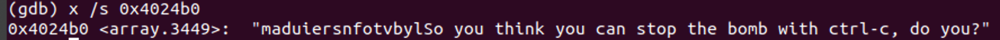
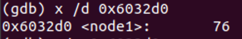
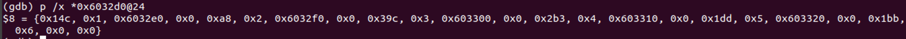
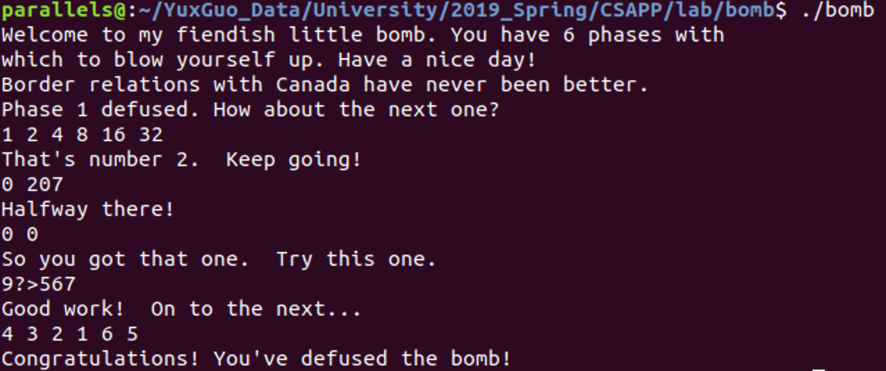

# bomb_lab

-   PB17111568
-   郭雨轩

---

## 准备工作

-   在我的电脑上面，因为没有安装虚拟机，于是使用wsl子系统完成实验。实验环境Ubuntu18.04。（后来装上了虚拟机）

-   首先从网上获取到bomb的实验程序，使用`tar -zvf bomb.tar` 将其解压，随后使用`objdump -d ./bomb > bomb.s`将反汇编得到的汇编代码重定向到`bomb.s` 中，~~虽然我全程是用gdb进行的调试，但是反汇编出来的代码让我对炸弹的整体情况有了一些了解，在查看参数传递时候也有一些帮助~~。同时，通过阅读c语言的代码，对其结构更清晰 ，c代码如下：

    ``` c
    /***************************************************************************
     * Dr. Evil's Insidious Bomb, Version 1.1
     * Copyright 2011, Dr. Evil Incorporated. All rights reserved.
     *
     * LICENSE:
     *
     * Dr. Evil Incorporated (the PERPETRATOR) hereby grants you (the
     * VICTIM) explicit permission to use this bomb (the BOMB).  This is a
     * time limited license, which expires on the death of the VICTIM.
     * The PERPETRATOR takes no responsibility for damage, frustration,
     * insanity, bug-eyes, carpal-tunnel syndrome, loss of sleep, or other
     * harm to the VICTIM.  Unless the PERPETRATOR wants to take credit,
     * that is.  The VICTIM may not distribute this bomb source code to
     * any enemies of the PERPETRATOR.  No VICTIM may debug,
     * reverse-engineer, run "strings" on, decompile, decrypt, or use any
     * other technique to gain knowledge of and defuse the BOMB.  BOMB
     * proof clothing may not be worn when handling this program.  The
     * PERPETRATOR will not apologize for the PERPETRATOR's poor sense of
     * humor.  This license is null and void where the BOMB is prohibited
     * by law.
     ***************************************************************************/
    
    #include <stdio.h>
    #include <stdlib.h>
    #include "support.h"
    #include "phases.h"
    
    /*
     * Note to self: Remember to erase this file so my victims will have no
     * idea what is going on, and so they will all blow up in a
     * spectaculary fiendish explosion. -- Dr. Evil
     */
    
    FILE *infile;
    
    int main(int argc, char *argv[])
    {
        char *input;
    
        /* Note to self: remember to port this bomb to Windows and put a
         * fantastic GUI on it. */
    
        /* When run with no arguments, the bomb reads its input lines
         * from standard input. */
        if (argc == 1) {
            infile = stdin;
        }
    
        /* When run with one argument <file>, the bomb reads from <file>
         * until EOF, and then switches to standard input. Thus, as you
         * defuse each phase, you can add its defusing string to <file> and
         * avoid having to retype it. */
        else if (argc == 2) {
            if (!(infile = fopen(argv[1], "r"))) {
                printf("%s: Error: Couldn't open %s\n", argv[0], argv[1]);
                exit(8);
            }
        }
    
        /* You can't call the bomb with more than 1 command line argument. */
        else {
            printf("Usage: %s [<input_file>]\n", argv[0]);
            exit(8);
        }
    
        /* Do all sorts of secret stuff that makes the bomb harder to defuse. */
        initialize_bomb();
    
        printf("Welcome to my fiendish little bomb. You have 6 phases with\n");
        printf("which to blow yourself up. Have a nice day!\n");
    
        /* Hmm...  Six phases must be more secure than one phase! */
        input = read_line();             /* Get input                   */
        phase_1(input);                  /* Run the phase               */
        phase_defused();                 /* Drat!  They figured it out!
                                          * Let me know how they did it. */
        printf("Phase 1 defused. How about the next one?\n");
    
        /* The second phase is harder.  No one will ever figure out
         * how to defuse this... */
        input = read_line();
        phase_2(input);
        phase_defused();
        printf("That's number 2.  Keep going!\n");
    
        /* I guess this is too easy so far.  Some more complex code will
         * confuse people. */
        input = read_line();
        phase_3(input);
        phase_defused();
        printf("Halfway there!\n");
    
        /* Oh yeah?  Well, how good is your math?  Try on this saucy problem! */
        input = read_line();
        phase_4(input);
        phase_defused();
        printf("So you got that one.  Try this one.\n");
    
        /* Round and 'round in memory we go, where we stop, the bomb blows! */
        input = read_line();
        phase_5(input);
        phase_defused();
        printf("Good work!  On to the next...\n");
    
        /* This phase will never be used, since no one will get past the
         * earlier ones.  But just in case, make this one extra hard. */
        input = read_line();
        phase_6(input);
        phase_defused();
    
        /* Wow, they got it!  But isn't something... missing?  Perhaps
         * something they overlooked?  Mua ha ha ha ha! */
    
        return 0;
    }
    ```

    可以看到，所有的密码是否正确都在对应的phase_{*}中进行检查。

## 开始拆弹

### phase_1

这个炸弹比较简单，在gdb中使用`disassemble phase_1` 反汇编得到代码

``` assembly
# Dump of assembler code for function phase_1:
   0x0000000000400ee0 <+0>:     sub    $0x8,%rsp
   0x0000000000400ee4 <+4>:     mov    $0x402400,%esi
   0x0000000000400ee9 <+9>:     callq  0x401338 <strings_not_equal>
   0x0000000000400eee <+14>:    test   %eax,%eax
   0x0000000000400ef0 <+16>:    je     0x400ef7 <phase_1+23>
   0x0000000000400ef2 <+18>:    callq  0x40143a <explode_bomb>
   0x0000000000400ef7 <+23>:    add    $0x8,%rsp
   0x0000000000400efb <+27>:    retq
```

其中，在进入phase_1之前，已经将用户输入的字符串的起始地址放入rdi中，第二个参数在`phase_1` 中被置为`0x402400` ，接下来调用了一个`strings_not_equal` 的函数，可以推断，这是一个字符串比较的函数，将用户输入的字符串和内存中的一个字符串进行比较，若相等则通过。在gdb中使用`x /s 0x402400` 得到phase_1为`Border relations with Canada have never been better.` 

---

### phase_2

这个炸弹也比较简单，执行`disassemble phase_2` 得到汇编代码如下：

``` assembly
# Dump of assembler code for function phase_2:
   0x0000000000400efc <+0>:     push   %rbp
   0x0000000000400efd <+1>:     push   %rbx
   0x0000000000400efe <+2>:     sub    $0x28,%rsp
   0x0000000000400f02 <+6>:     mov    %rsp,%rsi
   0x0000000000400f05 <+9>:     callq  0x40145c <read_six_numbers>
   0x0000000000400f0a <+14>:    cmpl   $0x1,(%rsp)
   0x0000000000400f0e <+18>:    je     0x400f30 <phase_2+52>
   0x0000000000400f10 <+20>:    callq  0x40143a <explode_bomb>
   0x0000000000400f15 <+25>:    jmp    0x400f30 <phase_2+52>
   0x0000000000400f17 <+27>:    mov    -0x4(%rbx),%eax
   0x0000000000400f1a <+30>:    add    %eax,%eax
   0x0000000000400f1c <+32>:    cmp    %eax,(%rbx)
   0x0000000000400f1e <+34>:    je     0x400f25 <phase_2+41>
   0x0000000000400f20 <+36>:    callq  0x40143a <explode_bomb>
   0x0000000000400f25 <+41>:    add    $0x4,%rbx
   0x0000000000400f29 <+45>:    cmp    %rbp,%rbx
   0x0000000000400f2c <+48>:    jne    0x400f17 <phase_2+27>
   0x0000000000400f2e <+50>:    jmp    0x400f3c <phase_2+64>
   0x0000000000400f30 <+52>:    lea    0x4(%rsp),%rbx
   0x0000000000400f35 <+57>:    lea    0x18(%rsp),%rbp
   0x0000000000400f3a <+62>:    jmp    0x400f17 <phase_2+27>
   0x0000000000400f3c <+64>:    add    $0x28,%rsp
   0x0000000000400f40 <+68>:    pop    %rbx
   0x0000000000400f41 <+69>:    pop    %rbp
   0x0000000000400f42 <+70>:    retq
```

进入`phase_2` 可以看到，调用了一个`<read_six_numbers>` 的函数，字面上理解是读如六个数字。第一个数字在`%rsp`指向的位置，先检查它是否为1，

>0x0000000000400f0e <+18>:    je     0x400f30 <phase_2+52>

若为1则跳转过炸弹爆炸的函数，否则引爆炸弹。之后进入一个循环，循环的大致意思如下：

``` assembly
   #比较内存中地址为rsp的位置的值是否为1
   0x0000000000400f0a <+14>:    cmpl   $0x1,(%rsp) 
   #是1就跳转，不是1就顺序执行，调用爆炸函数
   0x0000000000400f0e <+18>:    je     0x400f30 <phase_2+52>
   0x0000000000400f10 <+20>:    callq  0x40143a <explode_bomb>
   0x0000000000400f15 <+25>:    jmp    0x400f30 <phase_2+52>
   # %eax <- *(%rbx-4) (在第一次循环中，这个值为1)
   0x0000000000400f17 <+27>:    mov    -0x4(%rbx),%eax
   # %eax <- 2*eax
   0x0000000000400f1a <+30>:    add    %eax,%eax
   # 若 (%rbx == %eax)，就跳过炸弹爆炸的函数，否则没事。
   0x0000000000400f1c <+32>:    cmp    %eax,(%rbx)
   0x0000000000400f1e <+34>:    je     0x400f25 <phase_2+41>
   0x0000000000400f20 <+36>:    callq  0x40143a <explode_bomb>
   # 否则就递增 %rbx，向栈底移动，再检查是否是最后一个数字（与%rbp比较）
   0x0000000000400f25 <+41>:    add    $0x4,%rbx
   0x0000000000400f29 <+45>:    cmp    %rbp,%rbx
   0x0000000000400f2c <+48>:    jne    0x400f17 <phase_2+27>
   0x0000000000400f2e <+50>:    jmp    0x400f3c <phase_2+64>
   # %rbx <- %rsp + 4 
   0x0000000000400f30 <+52>:    lea    0x4(%rsp),%rbx
   # %rbp <- %rsp +24 (联想到有6个数字，一个数字是4个字节，所以这个地址是第六个数字的地址)
   0x0000000000400f35 <+57>:    lea    0x18(%rsp),%rbp
   # 无条件跳转
   0x0000000000400f3a <+62>:    jmp    0x400f17 <phase_2+27>
```

从上面分析不难得出，输入6个数字，首项为1，公比为2。所以密码就是这个等比数列的前六项，也就是`1 2 4 8 16 32` （注意空格，盲猜是用`sscanf`读入的）。

---

### phase_3

用GDB反汇编得到的第一部分代码如下：

``` assembly
Dump of assembler code for function phase_3:
   0x0000000000400f43 <+0>:     sub    $0x18,%rsp
   0x0000000000400f47 <+4>:     lea    0xc(%rsp),%rcx
   0x0000000000400f4c <+9>:     lea    0x8(%rsp),%rdx
   0x0000000000400f51 <+14>:    mov    $0x4025cf,%esi
   0x0000000000400f56 <+19>:    mov    $0x0,%eax
   0x0000000000400f5b <+24>:    callq  0x400bf0 <__isoc99_sscanf@plt>
   0x0000000000400f60 <+29>:    cmp    $0x1,%eax
   0x0000000000400f63 <+32>:    jg     0x400f6a <phase_3+39>
   0x0000000000400f65 <+34>:    callq  0x40143a <explode_bomb>
   0x0000000000400f6a <+39>:    cmpl   $0x7,0x8(%rsp)
```

首先比较醒目的可以看到，汇编代码的第7行调用了`sscanf()`函数，需要先知道这个函数调用总共读取了什么信息，其中这个函数的第一个参数被放在了`0x4025cf`中，查看得：

可见要输入两个数字，`sscanf()`函数的返回值在eax中，代表读取成功的项数，而在第8行将其与1比较，若读取小于两个数字就爆炸。

``` assembly
   # 若第一个数字大于7，跳向爆炸
   0x0000000000400f6a <+39>:	cmpl   $0x7,0x8(%rsp)
   0x0000000000400f6f <+44>:	ja     0x400fad <phase_3+106>
   # 将第一个数字放到%eax中
   0x0000000000400f71 <+46>:	mov    0x8(%rsp),%eax
   # 这条语句的意思是跳向*(0x402470+%rax*8)的地方，使用gdb查看0x402470，得到0x7c，按照偏移挨个查看，就可以得到第一个数字在取值范围内的跳转地址，既然所有的情况都可以，所以我就选择第一个数字为0，得到跳向0x400f7c这个地址，对应的第二个数字是0xcf，十进制就是207，输入即可解除炸弹，当然，对于不同的第一个数字，第二个数字也相应的不同。
   0x0000000000400f75 <+50>:	jmpq   *0x402470(,%rax,8)
   0x0000000000400f7c <+57>:	mov    $0xcf,%eax
   0x0000000000400f81 <+62>:	jmp    0x400fbe <phase_3+123>
   0x0000000000400f83 <+64>:	mov    $0x2c3,%eax
   0x0000000000400f88 <+69>:	jmp    0x400fbe <phase_3+123>
   0x0000000000400f8a <+71>:	mov    $0x100,%eax
   0x0000000000400f8f <+76>:	jmp    0x400fbe <phase_3+123>
   0x0000000000400f91 <+78>:	mov    $0x185,%eax
   0x0000000000400f96 <+83>:	jmp    0x400fbe <phase_3+123>
   0x0000000000400f98 <+85>:	mov    $0xce,%eax
   0x0000000000400f9d <+90>:	jmp    0x400fbe <phase_3+123>
   0x0000000000400f9f <+92>:	mov    $0x2aa,%eax
   0x0000000000400fa4 <+97>:	jmp    0x400fbe <phase_3+123>
   0x0000000000400fa6 <+99>:	mov    $0x147,%eax
   0x0000000000400fab <+104>:	jmp    0x400fbe <phase_3+123>
   0x0000000000400fad <+106>:	callq  0x40143a <explode_bomb>
   0x0000000000400fb2 <+111>:	mov    $0x0,%eax
   0x0000000000400fb7 <+116>:	jmp    0x400fbe <phase_3+123>
   0x0000000000400fb9 <+118>:	mov    $0x137,%eax
   0x0000000000400fbe <+123>:	cmp    0xc(%rsp),%eax
   0x0000000000400fc2 <+127>:	je     0x400fc9 <phase_3+134>
   0x0000000000400fc4 <+129>:	callq  0x40143a <explode_bomb>
   0x0000000000400fc9 <+134>:	add    $0x18,%rsp
   0x0000000000400fcd <+138>:	retq   
```

最后得到密钥，`0 207`

---

### phase_4

先用gdb反汇编一段代码：

``` assembly
	 0x000000000040100c <+0>:	sub    $0x18,%rsp
   0x0000000000401010 <+4>:	lea    0xc(%rsp),%rcx
   0x0000000000401015 <+9>:	lea    0x8(%rsp),%rdx
   0x000000000040101a <+14>:	mov    $0x4025cf,%esi
   0x000000000040101f <+19>:	mov    $0x0,%eax
   0x0000000000401024 <+24>:	callq  0x400bf0 <__isoc99_sscanf@plt>
   0x0000000000401029 <+29>:	cmp    $0x2,%eax
   0x000000000040102c <+32>:	jne    0x401035 <phase_4+41>

```

与phase_3的套路类似，先查看`0x4025cf`，还是`"%d %d"`，接下来是对实际输入的参数个数的检查，若不等于2就爆炸。接下来是下一段汇编：

``` assembly
   # 先比较第一个数字是不是小于等于0xe，否则就爆炸。
   0x000000000040102e <+34>:	cmpl   $0xe,0x8(%rsp)
   0x0000000000401033 <+39>:	jbe    0x40103a <phase_4+46>
   0x0000000000401035 <+41>:	callq  0x40143a <explode_bomb>
   # 接下来是为func4调用准备参数，其中%edx为0xe，%esi为0，%edi为实际输入的第一个数字，然后调用func4
   0x000000000040103a <+46>:	mov    $0xe,%edx
   0x000000000040103f <+51>:	mov    $0x0,%esi
   0x0000000000401044 <+56>:	mov    0x8(%rsp),%edi
   0x0000000000401048 <+60>:	callq  0x400fce <func4>
```

然后是调用func4，这是一个递归函数，只有当返回值为0的时候才不会爆炸。

``` assembly
	 # 以a代指%edx，b代指%esi，c代指输入的第一个数字
	 0x0000000000400fce <+0>:	sub    $0x8,%rsp
   0x0000000000400fd2 <+4>:	mov    %edx,%eax # %eax=a;
   0x0000000000400fd4 <+6>:	sub    %esi,%eax # %eax=a-b;
   0x0000000000400fd6 <+8>:	mov    %eax,%ecx # %ecx=a-b;
   0x0000000000400fd8 <+10>:	shr    $0x1f,%ecx # %ecx=%ecx>>5;
   0x0000000000400fdb <+13>:	add    %ecx,%eax	# %eax=(a-b)>>5
   0x0000000000400fdd <+15>:	sar    %eax # %eax=(a-b)>>5+(a-b)>>1;
   # 因为(a-b)>>5==0,所以一顿计算最后就是(a-b)/2
   0x0000000000400fdf <+17>:	lea    (%rax,%rsi,1),%ecx # %ecx=(a-b)/2+b
   0x0000000000400fe2 <+20>:	cmp    %edi,%ecx 
   # 若输入的数字小于%ecx，就对a-1递归，return 2*func4(a-1,b,c);
   0x0000000000400fe4 <+22>:	jle    0x400ff2 <func4+36>
   0x0000000000400fe6 <+24>:	lea    -0x1(%rcx),%edx
   0x0000000000400fe9 <+27>:	callq  0x400fce <func4>
   0x0000000000400fee <+32>:	add    %eax,%eax
   0x0000000000400ff0 <+34>:	jmp    0x401007 <func4+57>
   # 否则先把返回值置为0，若c大于0，就对b+1递归，return 2*func4(a,b+1,c)+1;
   0x0000000000400ff2 <+36>:	mov    $0x0,%eax
   0x0000000000400ff7 <+41>:	cmp    %edi,%ecx
   0x0000000000400ff9 <+43>:	jge    0x401007 <func4+57>
   0x0000000000400ffb <+45>:	lea    0x1(%rcx),%esi
   0x0000000000400ffe <+48>:	callq  0x400fce <func4>
   0x0000000000401003 <+53>:	lea    0x1(%rax,%rax,1),%eax
   0x0000000000401007 <+57>:	add    $0x8,%rsp
   0x000000000040100b <+61>:	retq   
```

若func4的返回值部位0，就爆炸，若c大于0，则一定进入递归的第二个判断，返回值一定大于0，所以c<=0，若c小于0，第一个递归算到最后一定不为0，所以c=0。

``` assembly
	 0x000000000040104d <+65>:	test   %eax,%eax
   0x000000000040104f <+67>:	jne    0x401058 <phase_4+76>
   0x0000000000401051 <+69>:	cmpl   $0x0,0xc(%rsp)
   0x0000000000401056 <+74>:	je     0x40105d <phase_4+81>
   0x0000000000401058 <+76>:	callq  0x40143a <explode_bomb>
   0x000000000040105d <+81>:	add    $0x18,%rsp
   0x0000000000401061 <+85>:	retq   
```

从上面代码可以看出，第二个数字也为0，所以密码为`0 0`。

---

### phase_5

还是先用gdb反汇编一段代码：

``` assembly
Dump of assembler code for function phase_5:
   0x0000000000401062 <+0>:	push   %rbx
   0x0000000000401063 <+1>:	sub    $0x20,%rsp
   0x0000000000401067 <+5>:	mov    %rdi,%rbx
   0x000000000040106a <+8>:	mov    %fs:0x28,%rax
   0x0000000000401073 <+17>:	mov    %rax,0x18(%rsp)
   0x0000000000401078 <+22>:	xor    %eax,%eax
   0x000000000040107a <+24>:	callq  0x40131b <string_length>
   0x000000000040107f <+29>:	cmp    $0x6,%eax
   0x0000000000401082 <+32>:	je     0x4010d2 <phase_5+112>
   0x0000000000401084 <+34>:	callq  0x40143a <explode_bomb>
```

由于phase_5函数的参数是input，通过反汇编所有的代码可以看到，input被放在了%rdi中，然后清零%eax后调用strlen函数，这个函数的返回值在%eax中，若输入的字符串长度不为6，则触发炸弹。

接下来是另外一段代码：

``` assembly
0x00000000004010d2 <+112>:	mov    $0x0,%eax
0x00000000004010d7 <+117>:	jmp    0x40108b <phase_5+41>
```

其实就是清零了%eax，然后跳向正题。

然后是：

``` assembly
   # 此时%rax已经被清零了，所以就是将输入的字符串中第一个字符赋值给%ecx
   0x000000000040108b <+41>:	movzbl (%rbx,%rax,1),%ecx
   # 将%ecx的低8位压入栈，因为只取了低8位，所以可以推断输入的6个字符都是ascii码字中可包含的
   0x000000000040108f <+45>:	mov    %cl,(%rsp)
   # 转了个手赋值给了%rdx
   0x0000000000401092 <+48>:	mov    (%rsp),%rdx
   # 使用按位与取出了这个字符的低4位
   0x0000000000401096 <+52>:	and    $0xf,%edx
   # 把 *(0x4024b0，偏移字符低4位)放到%edx中
   0x0000000000401099 <+55>:	movzbl 0x4024b0(%rdx),%edx
   # 再把%edx的低8位放到栈中
   0x00000000004010a0 <+62>:	mov    %dl,0x10(%rsp,%rax,1)
   # 循环6次
   0x00000000004010a4 <+66>:	add    $0x1,%rax
   0x00000000004010a8 <+70>:	cmp    $0x6,%rax
   0x00000000004010ac <+74>:	jne    0x40108b <phase_5+41>
   # 在字符串结尾加个'\0'
   0x00000000004010ae <+76>:	movb   $0x0,0x16(%rsp)
   # 把这个内存地址中的字符串放到%esi中，用gdb看一下，是"flyers"
   # 检查一下，若两个串不等就爆炸
   0x00000000004010b3 <+81>:	mov    $0x40245e,%esi
   0x00000000004010b8 <+86>:	lea    0x10(%rsp),%rdi
   0x00000000004010bd <+91>:	callq  0x401338 <strings_not_equal>
   0x00000000004010c2 <+96>:	test   %eax,%eax
   0x00000000004010c4 <+98>:	je     0x4010d9 <phase_5+119>
   0x00000000004010c6 <+100>:	callq  0x40143a <explode_bomb>
   0x00000000004010cb <+105>:	nopl   0x0(%rax,%rax,1)
   0x00000000004010d0 <+110>:	jmp    0x4010d9 <phase_5+119>

```

现在看完了所有的逻辑，使用gdb看一下选择字符的内存中都是什么牛鬼蛇神。



应该是没加'\0'，所以把嘲讽的话也带出来了？取前16个字符，得到：

> "maduiersnfotvbyl"

要想拼出"flyers"，得到输入的ascii字符的低四位应该是

> 9 f e 5 6 7

查一下ascii码表，找几个字符满足这个条件，最后得到密码是 `9?>567`。

---

### phase_6

啊，终于到最后一个了。。。

先反汇编一下：

``` assembly
   0x00000000004010f4 <+0>:	push   %r14
   0x00000000004010f6 <+2>:	push   %r13
   0x00000000004010f8 <+4>:	push   %r12
   0x00000000004010fa <+6>:	push   %rbp
   0x00000000004010fb <+7>:	push   %rbx
   0x00000000004010fc <+8>:	sub    $0x50,%rsp
   0x0000000000401100 <+12>:	mov    %rsp,%r13
   0x0000000000401103 <+15>:	mov    %rsp,%rsi
   0x0000000000401106 <+18>:	callq  0x40145c <read_six_numbers>
   0x000000000040110b <+23>:	mov    %rsp,%r14
   0x000000000040110e <+26>:	mov    $0x0,%r12d
   0x0000000000401114 <+32>:	mov    %r13,%rbp
   0x0000000000401117 <+35>:	mov    0x0(%r13),%eax
   0x000000000040111b <+39>:	sub    $0x1,%eax
   0x000000000040111e <+42>:	cmp    $0x5,%eax
   0x0000000000401121 <+45>:	jbe    0x401128 <phase_6+52>
   0x0000000000401123 <+47>:	callq  0x40143a <explode_bomb>

```

这段代码显示把一堆寄存器入栈，然后调用第二个phase见过的读入六个数字的函数，然后把栈指针放到了%r14中，之后将%r12置为0，然后用%r13来放到栈指针中，在调用读入六个数字的函数之前先保存了栈底到%r13中，所以这段代码把栈指针切换到了栈底。

之后是另外一段汇编代码：

``` assembly
   0x0000000000401114 <+32>:	mov    %r13,%rbp
   0x0000000000401117 <+35>:	mov    0x0(%r13),%eax
   0x000000000040111b <+39>:	sub    $0x1,%eax
   0x000000000040111e <+42>:	cmp    $0x5,%eax
   0x0000000000401121 <+45>:	jbe    0x401128 <phase_6+52>
   0x0000000000401123 <+47>:	callq  0x40143a <explode_bomb>
   0x0000000000401128 <+52>:	add    $0x1,%r12d
   0x000000000040112c <+56>:	cmp    $0x6,%r12d
   0x0000000000401130 <+60>:	je     0x401153 <phase_6+95>
   0x0000000000401132 <+62>:	mov    %r12d,%ebx
   0x0000000000401135 <+65>:	movslq %ebx,%rax
   0x0000000000401138 <+68>:	mov    (%rsp,%rax,4),%eax
   0x000000000040113b <+71>:	cmp    %eax,0x0(%rbp)
   0x000000000040113e <+74>:	jne    0x401145 <phase_6+81>
   0x0000000000401140 <+76>:	callq  0x40143a <explode_bomb>
   0x0000000000401145 <+81>:	add    $0x1,%ebx
   0x0000000000401148 <+84>:	cmp    $0x5,%ebx
   0x000000000040114b <+87>:	jle    0x401135 <phase_6+65>
   0x000000000040114d <+89>:	add    $0x4,%r13
   0x0000000000401151 <+93>:	jmp    0x401114 <phase_6+32>

```

然后把读入的数字挨个检查，看下是不是全都小于等于6，还检查是不是里面有数字0。

再之后是程序代码：

``` assembly
   0x0000000000401153 <+95>:	lea    0x18(%rsp),%rsi
   0x0000000000401158 <+100>:	mov    %r14,%rax
   0x000000000040115b <+103>:	mov    $0x7,%ecx
   # 这个循环实现了将输入的6个数字全部替换成：7-输入
   0x0000000000401160 <+108>:	mov    %ecx,%edx
   0x0000000000401162 <+110>:	sub    (%rax),%edx
   0x0000000000401164 <+112>:	mov    %edx,(%rax)
   0x0000000000401166 <+114>:	add    $0x4,%rax
   0x000000000040116a <+118>:	cmp    %rsi,%rax
   0x000000000040116d <+121>:	jne    0x401160 <phase_6+108>
```

然后将%esi清零，跳向163处

``` assembly
   0x0000000000401176 <+130>:	mov    0x8(%rdx),%rdx
   0x000000000040117a <+134>:	add    $0x1,%eax
   0x000000000040117d <+137>:	cmp    %ecx,%eax
   0x000000000040117f <+139>:	jne    0x401176 <phase_6+130>
   0x0000000000401181 <+141>:	jmp    0x401188 <phase_6+148>
   0x0000000000401183 <+143>:	mov    $0x6032d0,%edx
   0x0000000000401188 <+148>:	mov    %rdx,0x20(%rsp,%rsi,2)
   0x000000000040118d <+153>:	add    $0x4,%rsi
   0x0000000000401191 <+157>:	cmp    $0x18,%rsi
   0x0000000000401195 <+161>:	je     0x4011ab <phase_6+183>
   0x0000000000401197 <+163>:	mov    (%rsp,%rsi,1),%ecx
   0x000000000040119a <+166>:	cmp    $0x1,%ecx
   0x000000000040119d <+169>:	jle    0x401183 <phase_6+143>
   0x000000000040119f <+171>:	mov    $0x1,%eax
   0x00000000004011a4 <+176>:	mov    $0x6032d0,%edx
   0x00000000004011a9 <+181>:	jmp    0x401176 <phase_6+130>
```

先看一下`0x6032d0`：



可以发现这是个链表，进一步看到所有的节点：



对照上面那一堆汇编代码，可以看到，这其实是根据输入的六个数字的顺序来将数字对应的节点排序。

``` assembly
   0x00000000004011ab <+183>:	mov    0x20(%rsp),%rbx
   0x00000000004011b0 <+188>:	lea    0x28(%rsp),%rax
   0x00000000004011b5 <+193>:	lea    0x50(%rsp),%rsi
   0x00000000004011ba <+198>:	mov    %rbx,%rcx
   0x00000000004011bd <+201>:	mov    (%rax),%rdx
   0x00000000004011c0 <+204>:	mov    %rdx,0x8(%rcx) # p->next赋值
   0x00000000004011c4 <+208>:	add    $0x8,%rax
   0x00000000004011c8 <+212>:	cmp    %rsi,%rax
   0x00000000004011cb <+215>:	je     0x4011d2 <phase_6+222>
   0x00000000004011cd <+217>:	mov    %rdx,%rcx
   0x00000000004011d0 <+220>:	jmp    0x4011bd <phase_6+201>
   0x00000000004011d2 <+222>:	movq   $0x0,0x8(%rdx)
```

这段代码根据排序的顺序将链表的每个节点之间建立顺序。

``` assembly
   0x00000000004011da <+230>:	mov    $0x5,%ebp
   0x00000000004011df <+235>:	mov    0x8(%rbx),%rax
   0x00000000004011e3 <+239>:	mov    (%rax),%eax
   0x00000000004011e5 <+241>:	cmp    %eax,(%rbx)
   0x00000000004011e7 <+243>:	jge    0x4011ee <phase_6+250> # 若前面大于等于后面，跳过爆炸
   0x00000000004011e9 <+245>:	callq  0x40143a <explode_bomb>
   0x00000000004011ee <+250>:	mov    0x8(%rbx),%rbx
   0x00000000004011f2 <+254>:	sub    $0x1,%ebp
   0x00000000004011f5 <+257>:	jne    0x4011df <phase_6+235>
```

这段代码只有当链表排好序后是递减的才不会爆炸。

所以根据链表节点中的值：

> 1: 332
>
> 2: 168
>
> 3: 924
>
> 4: 691
>
> 5: 477
>
> 6: 443

得出每个节点的放置位置：`3 4 5 6 1 2`，由于这个结果是被7-原结果转换过的，所以还需要再转换回去，得到原数字序列：`4 3 2 1 6 5`，这也就是最后的密钥。

### 实验截图

最后附上一张拆弹成功的截图：



## 实验收获

- 本次实验挺有意思的，让我对x86的汇编有了比较深刻的理解，尤其是关于函数调用的规范以及参数传递的规范方面，我还学会使用GDB作为调试工具。同时，在阅读汇编的过程中，可以看到，对于同样结果的过程，在汇编级别有很多种表示方式，以及一些关于栈的操作其实是对解题没有什么影响的。这个实验我最开始是在3月份做的，一开始觉得困难重重，等到6月份重新开始这个实验的时候，我又读了一遍csapp的书，这个时候再看这个实验中繁多的汇编就能一下子抓住本质了，对于一些约定俗成的汇编也能快速理解，总的来说收获很大。